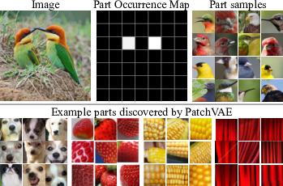
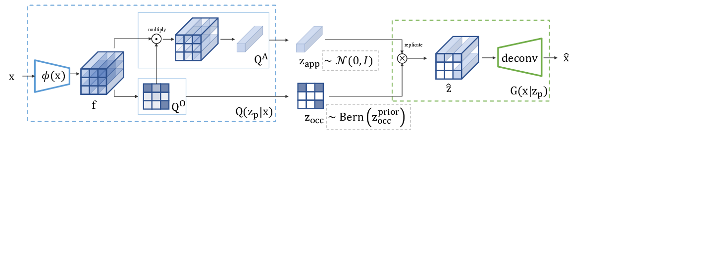

# PatchVAE

Implementation of [PatchVAE: Learning Local Latent Codes for Recognition](https://arxiv.org/abs/2004.03623) in PyTorch.



PatchVAE learns to encode repetitive parts across a dataset, 
by modeling their appearance and occurrence. 
(top) Given an image, the occurrence map of a particular part learned by PatchVAE is shown in the middle, capturing the head/beak of the birds.
Samples of the same part from other images are shown on the right, indicating consistent appearance.
(bottom) More examples of parts discovered by our PatchVAE framework.



Our encoder network computes a set of feature maps f using $\phi(x)$. 
This is followed by two independent single layer networks. 
The bottom network generates part occurrence parameters $Q^O$.
We combine $Q^O$ with output of top network to generate part appearance parameters $Q^A$.
We sample $z_{occ}$ and $z_{app}$ to construct $\hat{z}$ which is input to the decoder network.
We also visualize the corresponding priors for latents zapp and zocc in the dashed gray boxes.


A few representative examples for several parts to qualitatively demonstrate the visual concepts captured by PatchVAE.
For each part, we crop image patches centered on the part location where it is predicted to be present.
Selected patches are sorted by part occurrence probability as score.
We manually select a diverse set from the top-50 occurrences from the training images.
As can be seen, a single part may capture diverse set of concepts that are similar in shape or texture or occur in similar context, but belong to different categories.
We show which categories the patches come from (note that category information was not used while training the model).


If you use this code in your work, please cite
```
@inproceedings{
    gupta2020patchvae,
    title={PatchVAE: Learning Local Latent Codes for Recognition},
    author={Kamal Gupta and Saurabh Singh and Abhinav Shrivastava},
    booktitle={Conference on Computer Vision and Pattern Recognition},
    year={2020},
    url={},
}
```

## Installation

You'll need

* torch
* tensorboard
* scikit-learn
* Training [data](#datasets)

Also add the current directory to python path

```
export PYTHONPATH=".:$PYTHONPATH"
```

## Datasets
Some datasets require a bit of preprocessing

### 1. MIT Indoor 67

```
# Download the dataset
wget http://groups.csail.mit.edu/vision/LabelMe/NewImages/indoorCVPR_09.tar
wget http://web.mit.edu/torralba/www/TrainImages.txt
wget http://web.mit.edu/torralba/www/TestImages.txt

# Uncompress it
tar -xf indoorCVPR_09.tar

# Split the data into train and test
python utils/indoor.py \
    --image-dir data/indoor/Images \
    --split-file data/indoor/TestImages.txt \
    --target-dir data/indoor/test
    
# Make a copy of allminustest
cp -r data/indoor/Images data/indoor/allminustest

python utils/indoor.py \
    --image-dir data/indoor/Images \
    --split-file data/indoor/TrainImages.txt \
    --target-dir data/indoor/train
```

## Training

You can see all command line options by running
```
python run.py --help
```

### PatchVAE

Training on [CIFAR](https://www.cs.toronto.edu/~kriz/cifar.html)
```
python run.py \
    --dataset=cifar100 \
    --data-folder /path/to/cifar/dataset \
    --output-folder /path/to/logs/directory \
    --num-parts=16  \
    --hidden-size=6 \
    --inet
```

Training on [Places](http://places.csail.mit.edu/downloadData.html)
```
python run.py \
    --dataset=places205 \
    --data-folder /path/to/places/dataset \
    --output-folder /path/to/logs/directory \
    --num-parts=16  \
    --hidden-size=6 \
    --inet
```

Training on [Imagenet](http://www.image-net.org)
```
python run.py \
    --dataset=imagenet \
    --data-folder /path/to/imagenet/dataset \
    --output-folder /path/to/logs/directory \
    --num-parts=64 \
    --hidden-size=16 \
    --lr=2e-4 \
    --num-epochs=140 \
    --inet \
    --size=224 \
    --batch-size=256 \
    --scale=32
```

### Supervised

Train resenet from scratch

```
python classifier.py \
    --dataset=imagenet \
    --data-folder /path/to/imagenet/dataset \
    --output-folder /path/to/logs/directory \
    --epochs=30 \
    --lr=0.1 \
    --batch-size=256 \
    --arch=resnet18 \
    --inet \
    --workers=4 \
    --scale=32 \
    --size=224
```

Train a PatchVAE model (after freezing certain layers)
```
python classifier.py \
    --dataset=imagenet \
    --data-folder /path/to/imagenet/dataset \
    --output-folder /path/to/logs/directory \
    --arch=patchy \
    --pretrained ./scratch/model.pt \
    --encoder-arch=resnet \
    --freeze=8 \
    --epochs=30 \
    --lr=0.1 \
    --batch-size=256 \
    --arch=resnet18 \
    --inet \
    --num-parts=64 \
    --hidden-size=16 \
    --workers=4 \
    --scale=32 \
    --size=224
```

## License

MIT
